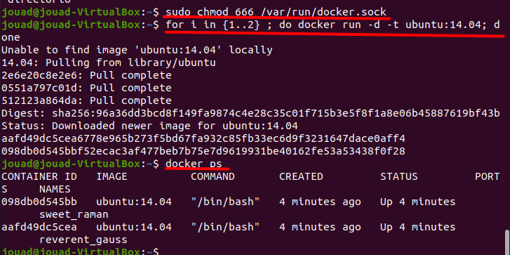
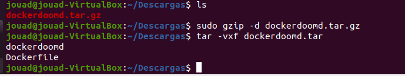
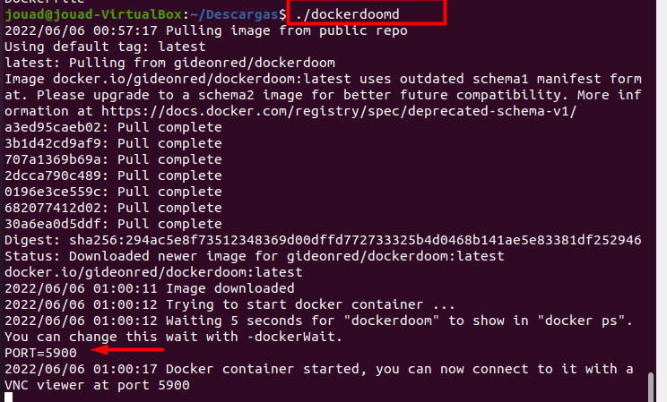
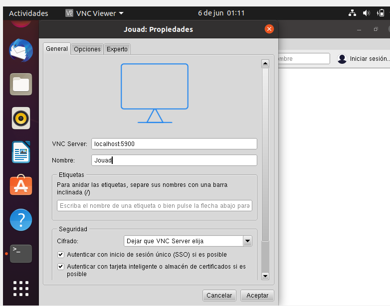
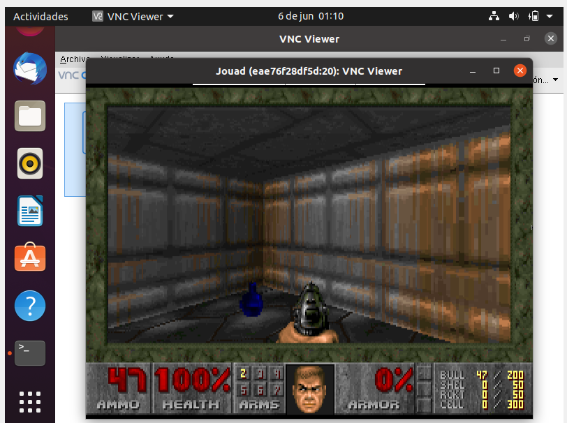
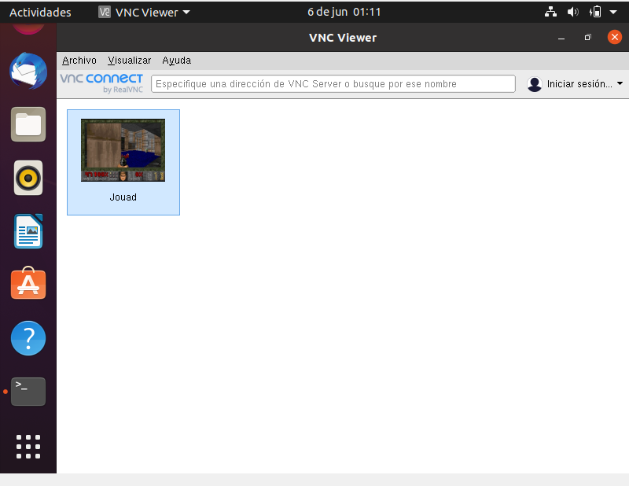

# Docker-Doom

*Práctica realziada con una máquina virtual - Ubuntu Desktop 20.04*

## Instalación

Una vez tengamos docker instalado ejecutamos los siguientes comandos.

```
- sudo chmod 666 /var/run/docker.sock
- for i in {1..2} ; do docker run -d -t ubuntu:14.04; done
```


Descargamos la imagen **dockerdoomd** y nos situamos en el mismo directorio



La ejecutamos para comprobar el puerto



Con VNC Viewer instalado es suficiente con ejecutar el mismo puerto para tener el juego a nuestra disposición.




